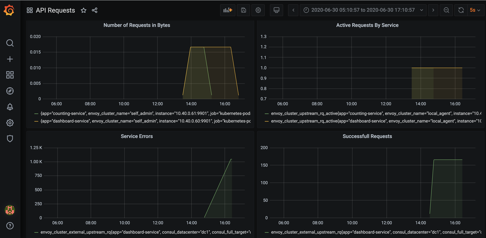

# Consul Service Mesh Basic Example

Allows you to spin up a HashiCorp Service Mesh on Kubernetes with Visualization using Grafana within 5 minutes


## Install

1. Ensure that you have kubectl and helm 3 installed on your machine and it's configured to point to a Kubernetes cluster that you want to use

2. Execute the following:

```
git clone https://github.com/mackhendricks/consul-servicemesh-basic
cd consul-servicemesh-basic/completed
./demo.sh install
```

3. Follow the instructions after the install.  This is what the dashboard will
look like once it runs for a while




## Uninstall

```
cd consul-servicemesh-basic/completed
./demo.sh uninstall
```
